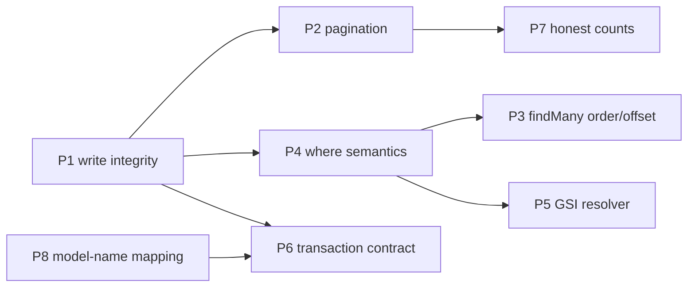

# Plan — better-auth Adapter-Contract Fixes (scoped)

**Date:** 2026-07-06
**Status:** IMPLEMENTED on branch `fix/adapter-contract-compliance` (all 9 phases).
Implementation deltas from the plan below:

- `buildExpression` uses a **minimal-paren** left fold (parens only when the
  connector changes mid-fold) — required because Tier-2
  `KeyConditionExpression`s are built through the same function and DynamoDB's
  key-condition grammar rejects parenthesized conditions.
- `consumeOne` folds extra Tier-1 where clauses into an atomic
  `ConditionExpression` on the DeleteCommand (stronger than the planned
  read-then-verify); `ends_with` conditions pre-verify client-side.
- `txUpdate` gained a narrow **read-your-writes overlay**: an update targeting
  a row created earlier in the same transaction patches the buffered Put in
  place instead of returning null.
- The tx capacity off-by-N fix (review #19, originally deferred as
  email-feature work) landed anyway — the accurate-count restructuring fell
  out of the tx handler rewrites for free.
- Empty-`in`/`not_in` are constant-folded algebraically through the fold
  (`alwaysFalse` plan flag + short-circuits in every consumer), with unused
  `#nX`/`:vX` refs pruned to satisfy DynamoDB's unused-value validation.
**Source:** [CODE-REVIEW-2026-07-05.md](./CODE-REVIEW-2026-07-05.md) (finding numbers below reference that doc)
**Scope rule:** ship only what makes this package a *correct better-auth adapter* — the standard adapter methods better-auth calls (`create`, `findOne`, `findMany`, `count`, `update`, `updateMany`, `delete`, `deleteMany`, `consumeOne`) and the `transaction` option, with better-auth's semantics. Everything specific to this project's own value-add features (email-uniqueness sidecar, middleware/extensions, config-validation DX) is **deferred** — see the Deferred section.

All items below were re-verified against the codebase (commit `0313fde`) and against
`@better-auth/core/dist/db/adapter/factory.mjs` on 2026-07-06. Key feasibility facts confirmed:

- The `adapter` callback receives `{ options, schema, debugLog, getFieldName, getModelName, getDefaultModelName, getDefaultFieldName, getFieldAttributes, transformInput, transformOutput, transformWhereClause }` (factory.mjs:387-399) — everything needed for the transaction fix is already handed to us; `factory.ts:150-158` currently captures only 3 of these into `helpersRef`.
- `getModelName` applies `usePlural`/`modelName` mapping **before** every adapter call (factory.mjs:413, 579; get-model-name.mjs) → new finding C10 below.
- `mode: "insensitive"` has **no usages** anywhere in better-auth dist (plugins lowercase instead) → throwing on it is contract-acceptable; document only. `ends_with` **is** used (admin plugin `searchOperator`) → must be supported (C8).

---

## Phase 1 — Destructive-write integrity (review #1, #2, #16, #17)

The shared root cause: Tier-1 (`getItem`) plans leak into scan-shaped helpers that
read `plan.filterExpression` (which Tier-1 plans never populate) → unfiltered
Scan → wrong-row or whole-table writes.

| Step | File | Change |
|------|------|--------|
| 1.1 | `src/helpers/query-planner.ts:123-130` | `tryTier1` returns a plan **only when the key is complete** (SK present whenever `schema.skField` is set). Incomplete → fall through to Tier 2/3. Fixes partial-key `GetItem` crashes in `findOne`/`findMany` (#17) and removes one incomplete-Tier-1 entry path. |
| 1.2 | `src/helpers/resolve-item.ts:27` | Throw `DynamoAdapterError("INVALID_PLAN")` if `plan.tier === 1` — this helper is Tier-2/3 only. |
| 1.3 | `src/adapter/methods/update.ts:51-73`, `delete.ts:39-64` | For Tier-1 plans with `needsClientSideFilter`: `GetCommand` on `plan.key` + `matchesClientFilters` (the pattern `find-one.ts:33-49` already uses), instead of routing to `resolveItemByPlan`. |
| 1.4 | `src/adapter/methods/update-many.ts:57` | Pass `includeTier1: true` to `findAllItems` (as `delete-many.ts:47` already does). |
| 1.5 | `src/helpers/find-items.ts:52-62` | In the `includeTier1` branch, apply `plan.clientSideFilters` to the fetched item; return `[]` on mismatch (#16, deleteMany over-deletion). |
| 1.6 | `src/adapter/methods/consume-one.ts:42-52` | Tier-1 branch: when `plan.needsClientSideFilter`, verify via `GetCommand` + `matchesClientFilters` before the delete — or better, fold extra `eq` clauses into the `DeleteCommand`'s `ConditionExpression` (atomic; no read needed). |
| 1.7 | `src/helpers/fetch-all.ts:80` | Guard the scan branch with `plan.operation === "scan"`; anything else throws. Backstop so a `getItem` plan can never silently become a table scan again. |

**Regression tests:** Tier-1 + extra filter clause for `update`/`delete`/`updateMany`/`deleteMany`/`consumeOne`; composite-key model queried by PK only.

## Phase 2 — Single-item resolution pagination (review #3)

| Step | File | Change |
|------|------|--------|
| 2.1 | `src/helpers/resolve-item.ts:35-83` | Replace both single-shot `Limit: 1` requests with a `LastEvaluatedKey` loop: page with a sane page size (drop `Limit: 1`; DynamoDB pages at 1 MB, or use e.g. `Limit: 100`), stop as soon as one item passes, cap total examined items with `config.maxScanItems` (throw `SCAN_LIMIT_EXCEEDED` past it). The KEYS_ONLY follow-up stays as-is. |

Note: `fetchAllByPlan` already loops correctly, but reusing it with `limit: 1`
would page one evaluated item at a time (its `Limit` math is `remaining -
items.length`) — implement the loop in `resolve-item.ts` with a page-size
constant instead.

**Regression tests:** findOne by non-key field where the match is *not* the first item (Tier 3, and Tier 2 with residual filter).

## Phase 3 — `findMany` ordering & pagination (review #6, #29)

| Step | File | Change |
|------|------|--------|
| 3.1 | `src/adapter/methods/find-many.ts:212-225` | Fix `findGsiRangeKey`: iterate `Object.values(modelIndexes)` (one level — `modelIndexes` is `Record<fieldName, GsiDeclaration>` per types.ts:54). |
| 3.2 | `find-many.ts:82-119` | When `needsClientSort` is true: call `fetchAllByPlan` **without** `limit`, enforce `maxScanItems` (mirror the Tier-3 "Gap D" branch at lines 133-153), sort, then slice. Only pass `limit` + `ScanIndexForward` when `sortBy.field` **is** the range key (or no sortBy). |
| 3.3 | `find-many.ts:75-79` | Tier-2 `offset`: replace the throw with discard-emulation + the same RCU warning Tier 3 uses (contract parity — admin/organization pagination over a GSI must not 500). |
| 3.4 | `find-many.ts:55-71` | Tier-1 branch: return `[]` when `(args.offset ?? 0) > 0`. |

**Regression tests:** the verification-flow shape — `findMany({model: "verification", where: [identifier eq], sortBy: {createdAt desc}, limit: 1})` over a hash-only GSI with 3+ rows must return the newest; sortBy ≠ rangeKey with limit; Tier-2 offset.

## Phase 4 — Where-clause semantics (review #8, #12, #13, #25, #28, #15)

| Step | File | Change |
|------|------|--------|
| 4.1 | `src/helpers/where-converter.ts:113-176` | `in: []` → vacuously false: signal the caller to short-circuit (empty result) — add e.g. `alwaysFalse: true` to `ConvertedWhere` and handle it in `find-many`/`find-one`/`count`/`find-items` (return empty/0/null without a DDB call). `not_in: []` → omit the fragment (vacuously true). |
| 4.2 | `src/helpers/query-planner.ts` | Bail out of Tier 1 **and** Tier 2 to Tier 3 whenever (a) any clause has `connector: "OR"`, or (b) the candidate key field appears in more than one clause. Prevents OR→AND rewrites and silently-dropped duplicate clauses. |
| 4.3 | `src/helpers/where-converter.ts:297-327` | Rewrite `buildExpression` as better-auth's left-to-right fold: `expr = frag0; for next: expr = "(" + expr + ") " + connector + " " + frag` — exactly the memory adapter's semantics (`(A OR B) AND C`). Document that the kysely adapter differs and memory is the reference. |
| 4.4 | `where-converter.ts:77-203` | Run every operator's value(s) through the Date→ISO conversion `update-item.ts`'s `sanitizeValue` uses (import it). Fixes marshaller crashes on tx-path/direct reads. |
| 4.5 | `query-planner.ts:197-210` | Range-key handling: only the **first** sort-key-operator clause enters `keyConditionClauses`; further clauses on the same field go to `filterClauses` (avoids "sort key referenced twice" ValidationException). |
| 4.6 | `src/helpers/resolve-item.ts:93-128` | `matchesClientFilters`: add `between`; make `contains` list-aware (`Array.isArray(itemVal) ? itemVal.includes(v) : string check`); `default:` → throw `UnsupportedOperatorError` instead of silently failing closed. |
| 4.7 | `where-converter.ts:205-210` + read paths | `ends_with`: emit a server-side `contains(#f, :v)` over-approximation **plus** a client-side `endsWith` post-filter on results (add an `ends_with` case to `matchesClientFilters` and thread post-filters through `find-many`/`find-one`/`count`/`find-items`). Correctness over efficiency; the admin plugin's `searchOperator=ends_with` must return results, not 500. Keep `mode: "insensitive"` throwing (no better-auth usage — verified), but document it. |

**Regression tests:** memory-adapter-equivalence table tests for mixed AND/OR folds; `in: []`; date-valued `lt/gt`; double range-key comparison; admin-search shapes (`contains`/`starts_with`/`ends_with`).

## Phase 5 — GSI handling consistency (review #14, #21)

| Step | File | Change |
|------|------|--------|
| 5.1 | New `src/helpers/gsi-resolver.ts` | Single `findGsiForField(model, field, config)` / `findGsiByIndexName(model, indexName, config)` matching on `gsi.hashKey`, used by `query-planner.ts:180`, `count.ts:34-50`, and `find-many.ts` (replaces `findGsiRangeKey`). Kills the three divergent readings of `config.indexes`. |
| 5.2 | `query-planner.ts:234` | `needsFollowUpGetItem` for **any** non-`"ALL"` projection (`"KEYS_ONLY"` *or* `{ include: [...] }`). |

## Phase 6 — Transaction contract (review #5, #9, #11, #18, #23, #24)

The contract (verified): `DBTransactionAdapter = Omit<DBAdapter, "transaction">` —
the callback must receive methods that behave like the framework-level adapter,
because `runWithTransaction` installs it as the ambient adapter for entire
request flows (all of sign-up).

| Step | File | Change |
|------|------|--------|
| 6.1 | `src/adapter/tx-types.ts`, `src/adapter/factory.ts:150-158` | Extend `TransactionFactoryHelpers` with `transformWhereClause`, `getModelName`, `getFieldName`, `getFieldAttributes` (all already provided by the factory — verified factory.mjs:387-399); capture them in `helpersRef`. |
| 6.2 | `src/adapter/transaction.ts:96-109` | Wrap `findOne`/`findMany`/`count`: apply `transformWhereClause({model, where, action})` to the where clause and `getModelName(model)` for table resolution before calling the native method, then apply `transformOutput` to results (`findMany` → per row). This is what `createAsIsTransaction` gives callers today. |
| 6.3 | `tx-update.ts`, `tx-delete.ts`, `tx-update-many.ts`, `tx-delete-many.ts`, `tx-consume-one.ts` | Apply `transformWhereClause` to `where` before `buildTxKey`/`findMany`; resolve model via `getModelName`. |
| 6.4 | `tx-update.ts:123` | `preState === null` → buffer nothing, return `null` (contract: update on missing row is `null`, and must not poison the transaction). |
| 6.5 | `tx-update-many.ts:35`, `tx-delete-many.ts:31` | Fetch **all** matching rows (explicit high limit from `maxUpdateManyItems`/`maxDeleteManyItems`, default 1000), then let `assertTransactionCapacity` throw loudly past 100. No silent truncation. |
| 6.6 | `tx-update-many.ts:58-66` | Add `ConditionExpression: "attribute_exists(#pk)"` per Update (blocks TOCTOU upsert-resurrection), mirroring `txUpdate`. |
| 6.7 | `transaction.ts:128-153` | Map `CancellationReasons` to distinct codes (`CONDITIONAL_CHECK_FAILED`, `TRANSACTION_CONFLICT`, `THROTTLED`); include the failing item's model/table in the message (reason index → `TransactItems[i]`). Gives `consumeOne` races a distinguishable failure instead of a generic 500. |
| 6.8 | `transaction.ts:79-127` | Track `(TableName, serialized Key)` while buffering; throw a descriptive error at buffer time on duplicate targets (DynamoDB would reject the flush opaquely anyway). |
| 6.9 | Docs + `transaction.ts` header | Document the remaining known limitation: reads do **not** see buffered writes (no read-your-writes). Verified acceptable for better-auth's current core flows (sign-up creates then returns; verification reads *before* writes) — a buffered-write overlay is explicitly out of scope for this pass. |

**Regression tests:** tx findOne/findMany return `Date` objects for date fields; tx update on missing row returns null and the tx still commits; tx deleteMany with 150 matching rows throws (not silently deletes 100); duplicate-target buffering throws.

## Phase 7 — Honest counts on bulk paths (review #20)

| Step | File | Change |
|------|------|--------|
| 7.1 | `delete-many.ts:120-123`, `update-many.ts:202-204` | After retry exhaustion with items still unprocessed: throw `DynamoAdapterError("PARTIAL_FAILURE", …)` carrying processed/total counts (better-auth callers must not believe a short count was "all of them"). |
| 7.2 | `src/helpers/batch-get.ts:89` | Same: unresolved keys after retries → throw `PARTIAL_FAILURE` (a `findMany` that silently returns fewer rows than matched is a correctness bug, not best-effort). |

## Phase 8 — Model-name mapping (NEW finding C10 — verified this session)

**Bug:** better-auth applies `getModelName` (custom `modelName` and `usePlural`)
*before* calling the adapter (factory.mjs:413,579; get-model-name.mjs). With
`usePlural: true` — an option this adapter itself exposes and forwards
(`types.ts:98`, `factory.ts:113`) — every method receives `"users"`/`"sessions"`,
so `getKeySchema`'s hardcoded `"user"`/`"session"`/`"account"` entries never
match and every core model silently degrades to `{ pkField: "id" }` (wrong PK
for `session`/`account` → broken writes/lookups against the physical tables).
`config.tables` / `config.indexes` lookups suffer the same mismatch.

| Step | File | Change |
|------|------|--------|
| 8.1 | `factory.ts` / `key-builder.ts` / `client.ts` | Normalize once at method entry: resolve the **default** model name via the factory's `getDefaultModelName` (available in `helpersRef`; fall back to identity) and use it for `getKeySchema`, `config.tables`, and `config.indexes` lookups. Document that `tables`/`indexes`/`keySchemas` are keyed by *default* (unmapped) model names. |
| 8.2 | Tests | `usePlural: true` smoke test: session create/findOne round-trip resolves `pkField: "token"` and the configured table. |

## Phase 9 — `rateLimit` core schema (review #26)

| Step | File | Change |
|------|------|--------|
| 9.1 | `src/helpers/key-builder.ts:34-40` | Add `rateLimit: { pkField: "key" }` to `coreSchemas` — better-auth's built-in rate-limit storage always queries by `key` (verified `api/rate-limiter/index.mjs`), never `id`. Turns a per-request full-table Scan into a Tier-1 GetItem. `config.keySchemas.rateLimit` still overrides. |
| 9.2 | README | Note the `rateLimit` table's expected PK when using `rateLimit.storage: "database"`. |

---

## Sequencing & effort

- **P1 + P2 first** (data integrity; small, localized diffs).
- **P4 before P3/P5** (planner bail-out changes what the findMany branches see).
- **P8 before P6** (tx wrappers use the same name-normalization helpers).
- Each phase: unit tests with *corrected* DynamoDB semantics in mocks + at least one DynamoDB Local integration test (docker-compose already provisions it on port 8001). Run `npm run type-check && npm test` per phase; full build before any commit.

## Explicitly deferred (project features — NOT in this pass)

| Review # | Item | Why deferred |
|----------|------|--------------|
| #4, #10, #19, #27, #30 | Email-uniqueness sidecar (dead update/delete wiring, unchanged-email swap, capacity off-by-N on email paths, hardcoded `"id"` PK, patch/ownership landmines) | This adapter's own invention — better-auth has no such contract. Only affects `enableEmailUniqueness: true`. |
| #7, #34 | Middleware/extensions hook chaining + missing type exports | Custom extension system, outside the adapter contract. |
| #22, #33 | Forgiving-tables Proxy hardening, duplicate-table validation | The Proxy fallback itself *serves* the contract (plugin models must work without explicit config); its harms are email-uniqueness/DX. |
| #31, #32 | Offset scan-cost cap, create-SK error clarity | Operational/DX guards, not contract semantics. |
| Improvements 1–3, 5–11 | Error taxonomy/retries, ConsistentRead flag, 4 MB pre-flight, count.ts merge consolidation, GSI selectivity, uuid, docs polish | Quality work, no contract impact. |

Note on `mode: "insensitive"`: stays a construction-documented throw — verified
zero usages in better-auth dist (core and bundled plugins lowercase instead of
passing insensitive mode).
